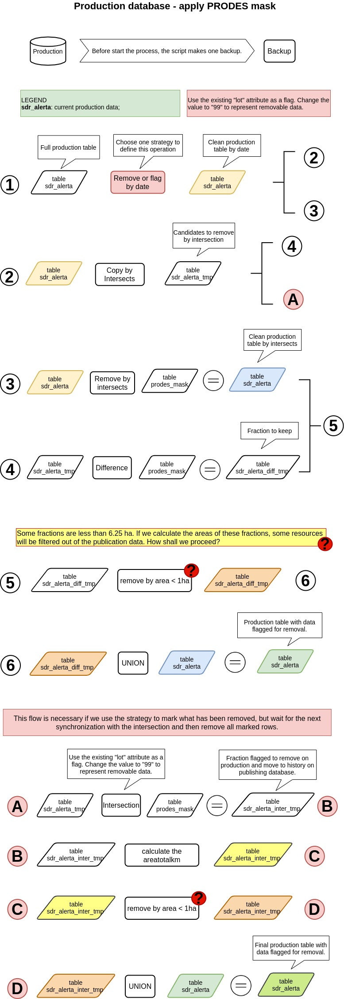
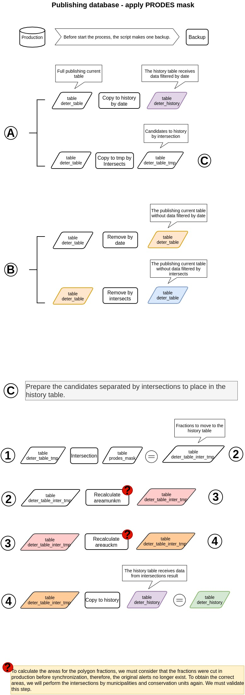
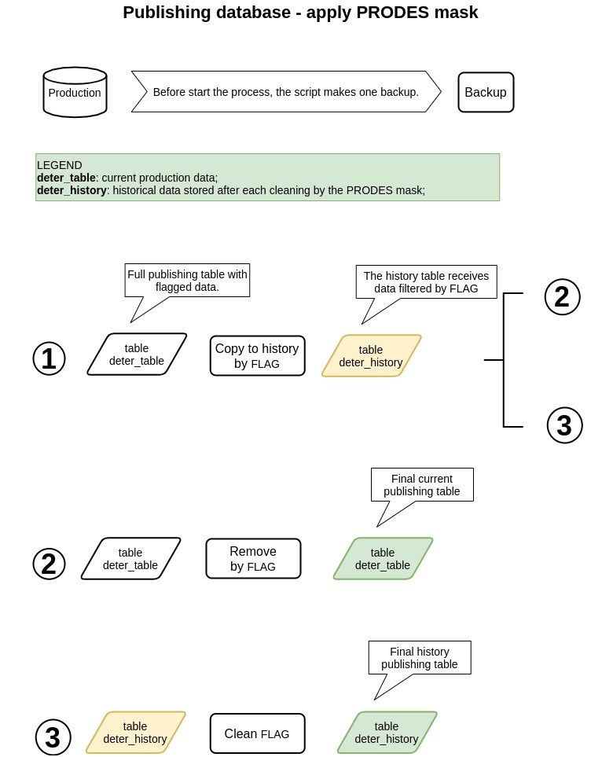

# Clean DETER using PRODES mask

Automate the workflow used to clear DETER data annually using the PRODES mask.

Go to the "Proposed flows" section of this document for details on the proposed flows.

## Ways of execution

There are two ways to perform this process.
 - Print only SQL scripts for debugging or direct use in the database;
 - Run directly on the database;

Note: the entry point is start_process.sh script.

### Print SQLs

To do this, edit the mode to true in the script_defines.sh script by changing the value of the ONLY_PRINT_SQL parameter.

 > ONLY_PRINT_SQL=true

Then, run the entry point script.

### Apply mask

Follow the steps below to perform the process:

 - Set the configurations for database before proceed (edit the pgconfig);
 - Verify if the backup of database is enable (edit the script_defines.sh);
 - Download the yearly_deforestation file of PRODES data;
 - Run the entry point script (start_process.sh).

# Proposed flows

There are 3 flows described here.

The first flow is defined as a base flow to apply the PRODES mask to the production database.

The second flow is defined to apply the PRODES mask to the publication database.

Its flow is difficult because it has several steps and the vector operations can generate different results from the production database, therefore, we designed a simple approach for the third flow.

The third flow is a simple approach and consists of waiting for the next production data synchronization after applying the PRODES mask.

This approach uses a strategy to flag removable data without removing. When this flagged data reaches the publication database, we move it to the history table and clear the flags.

