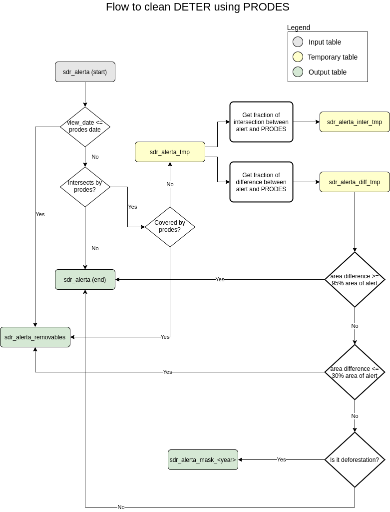

# Clean DETER using PRODES mask

Automate the workflow used to clear DETER data annually using the PRODES mask.

Go to the "Defined flow" section of this document for details about implemented flow.

## Ways of execution

There are two ways to perform this process.
 - Print only SQL scripts for debugging or direct use in the database;
 - Run directly on the database;

Note: the entry point is start_process.sh script.

### Print SQLs

To do this, edit the mode to true in the script_defines.sh script by changing the value of the ONLY_PRINT_SQL parameter. Changing ONLY_PRINT_SQL to false does not disable printing, it allows the process to run but keeps printing the SQL script file.

 > ONLY_PRINT_SQL=true

Then, run the entry point script.

After that, consult the two new files generated in the root directory, along with these scripts.

 > stack_trace_DD_MM_YYYY.log

 > print_queries_DD_MM_YYYY.sql

### Apply mask

Follow the steps below to perform the process:

 - Set the configurations for database before proceed (edit the pgconfig);
 - Verify if the backup of database is enable (edit the options.sh);
 - Download the yearly_deforestation file of PRODES data (a ZIP file is expected);
 - Run the entry point script (start_process.sh).

After that, consult the two new files generated in the root directory, along with these scripts.

 > stack_trace_DD_MM_YYYY.log
 
 > print_queries_DD_MM_YYYY.sql

# Defined flow

The flow implemented is in accordance with the diagram below.

To change this diagrams use the XML file "./doc/assets/flow_of_clean.drawio" and [diagrams.net](https://www.diagrams.net/) 12.9.9